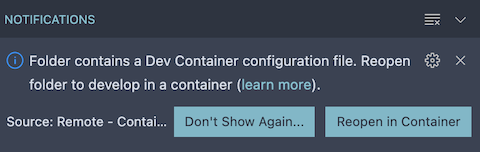

# Forge Components

Forge is a project that produces framework-agnostic Web Components for the browser. The components adhere to the standard W3C Web Components spec, and work seamlessly with the various front-end frameworks such as Angular, Vue, and React, as well as no framework at all.

The goal of this project is to create a set of high quality UI components for the browser platform that implement the Forge design system. The components can be shared across products and applications without requiring a specific version of a framework. This will help applications present themselves and function consistently, regardless of underlying architecture/technology.

The components within this library derive from Google's [Material Components Web](https://material-components.github.io/material-components-web-catalog/) project. This ensures that we are strictly following material guidelines while allowing us the flexibility to design for the specific needs of Tyler. With that being said, theming is built-in to the core of the library to make it easy to adapt design customizations, as well as use with other design systems as a whole.

To view more detailed information about the project, as well as the components that are currently available, please visit the [Forge design system website](https://forge.tylertech.com/).

**[Storybook](https://tyler-technologies.github.io/forge/master/)**

## Developing inside a container

This project supports vscode DevContainers to help streamline and standardize the local development process. To get started with DevContainers you'll need to ensure you're running the following on your local machine:

- Docker
- Visual Studio Code
- VSCode Remote Development extension pack.
- GITHUB_TOKEN environmental variable configured.

See these [getting-started](https://code.visualstudio.com/docs/remote/containers#_installation) instructions for additional details.

Once setup, VSCode should prompt with a notification that a DevContainer config file is recognized and suggest re-opening within a container.

You can create a new token `GITHUB_TOKEN` at https://github.com/settings/tokens with the `read:packages`. This needs to be added to your environment through your .bashrc, .zshrc or windows path environment settings. 

### Manually open current project in container
1. open project folder in vscode
1. open in container
1. wait for devcontainer to build (~5 minutes)
1. Serve the demo site to test the icons: `npm run start`
1. To build the npm package, run the following: `npm run build`

For more information on starting a development environment within a container see [Developing inside a Container](https://code.visualstudio.com/docs/remote/containers)

### DevContainers Performance Notes

When opening this project in a DevContainer on a Windows or Mac operating system, you may experience poor disk performance due to their use of bind mounts. See the following article for additional information and tips on how you might [improve disk performance](https://code.visualstudio.com/remote/advancedcontainers/improve-performance).

In situations where you're unable to make use of the WSL2 filesystem (Windows), or where you're using macOS, you'll experience the best performance by making use of the **Remote-Containers: Clone Repository in Container Volume** command within VSCode. See this [article](https://code.visualstudio.com/remote/advancedcontainers/improve-performance#_use-clone-repository-in-container-volume) for more information.

### Clone in containers
1. open vscode
1. clone repository in container
1. wait for devcontainer to build (~5 minutes)
1. Serve the demo site to test the icons: `npm run start`
1. To build the npm package, run the following: `npm run build`

> note: if you make any package changes and want them to persist you may need to rebuild the container

## Testing

To run tests over the whole project, use command: `npm run test`.
To run tests over a single component, use command: `forge test component <component name> [--browser chrome] [--port <port number>]`

### Testing in a container
To run tests over the whole project, use command: `npm run test:container`.
To run tests over a single component, use command: `forge test component <component name> --no-sandbox [--browser chrome] [--port <port number>]`
To connect via chrome visit `chrome://inspect/#devices` and select the correct instance
